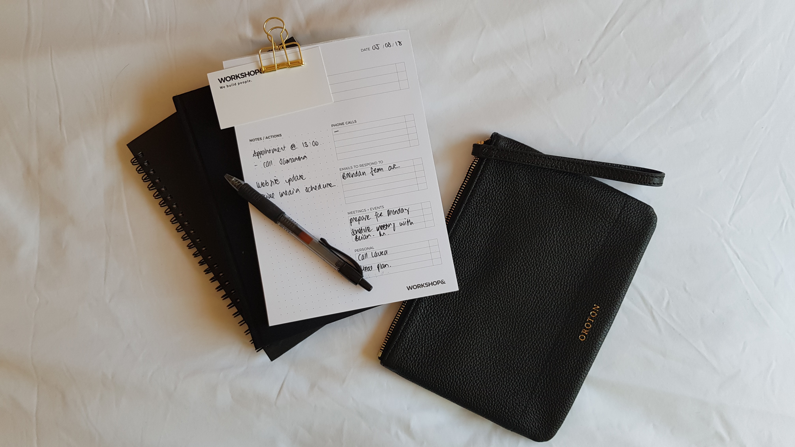

# ToDo App

## Pre-requisitos

Antes de iniciar debes instalar las siguientes herramientas, evaluar tu código e identificar posibles mejoras.

- [Instalar y utilizar Rubocop](https://github.com/bright-coders/commons/tree/master/topics/rubocop)
- [Instalar y utilizar Rubycritic](https://github.com/bright-coders/commons/tree/master/topics/rubycritic)
- [Instalar y utilizar SandiMeter](https://github.com/makaroni4/sandi_meter)

## Requerimientos funcionales

Yo should develop a TODO App that includes the following features:

Num | Feature | Notes
----- | ---- | ---- 
1 | Users should login to the App | [Clearance](https://github.com/thoughtbot/clearance) ó Devise/Omniauth  
2 | Users can create, read, update and delete (CRUD) lists of TODOs |
3 | Users can CRUD tasks on a list |
4 | Users can export their lists with their tasks to CSV and PDF files. |
5 | Users can update their profile: name, email, description and photo | Photo must be uploaded, you could use ActiveStorage for this task
7 | The app must include unit tests with Rspec |

Bonus
Num | Feature | Notes
----- | ---- | ---- 
1 | Users should receive weekly email including pending tasks | Using emails and BackgroundJobs with Sidekiq and Redis
2 | The app must include integration tests with Capybara | 

## Requerimientos no-funcionales
- Calidad
  - Utilizar estilo de código definido por la comunidad (apoyarse en Rubocop)
  - Pruebas unitarias
  - Puntuación en Rubycritic: por lo menos 90 en la carpeta de la App y por lo menos 65 en la carpeta de pruebas
  - Utilizar SandiMeter para analizar el código y utilizar el resultado para hacer mejoras
  - Presentación correcta en las versiones más recientes de los principales navegadores: Edge, Chrome, Safari y Firefox
- Deployment
  - Configuración de un servidor web (heroku o similar) para el deployment automático de actualizaciones de la app
  - [Configuración de un servidor de integración continua como Travis CI o Circle CI](https://circleci.com/features/ruby/)
- Frontend
  - CSS: libertad para utilizar cuaquier framework o librería, preferentemente SASS
    - Por ejemplo puedes utilizar Bootsrap junto con [bootstrap_form](https://github.com/bootstrap-ruby/bootstrap_form) para tus formularios

## Inspiración
En la carpeta [img](/img) hay algunos ejemplos de interfaz que te pueden servir de inspiración para el diseño de la UI de tu App

  ## Tecnologías
- Ruby on Rails en el backend
- PostgreSQL como base de datos principal
- CSS: libertad para utilizar cuaquier framework o librería, preferentemente SASS
  - Por ejemplo puede utilizar Bootsrap junto con [bootstrap_form](https://github.com/bootstrap-ruby/bootstrap_form) para tus formularios
- Javascript: libertad para utilizar cualquier framework o librería, preferentemente sin jQuery
- Framework para pruebas [Rspec](https://rspec.info/) ó [Minitest](https://github.com/seattlerb/minitest)

## Entregable
- Código fuente en Github 
  - Debe incluir README con información sobre como configurar el proyecto
  - Los commits de Git deben ser significativos
- Demo de la App correndo en heroku o similar
- Libertad para utilizar cualquier diseño, imágenes, etc, que considere necesarios y apropiados

## Setup
En [este elnace](setup/README.md) se describen los pasos necesarios para ejecutar/probar este proyecto, así como los integrantes de este equipo

## Enlaces
[Encuentra aquí una lista completa de recursos de ayuda](https://github.com/bright-coders/commons/tree/master/topics/resources)

